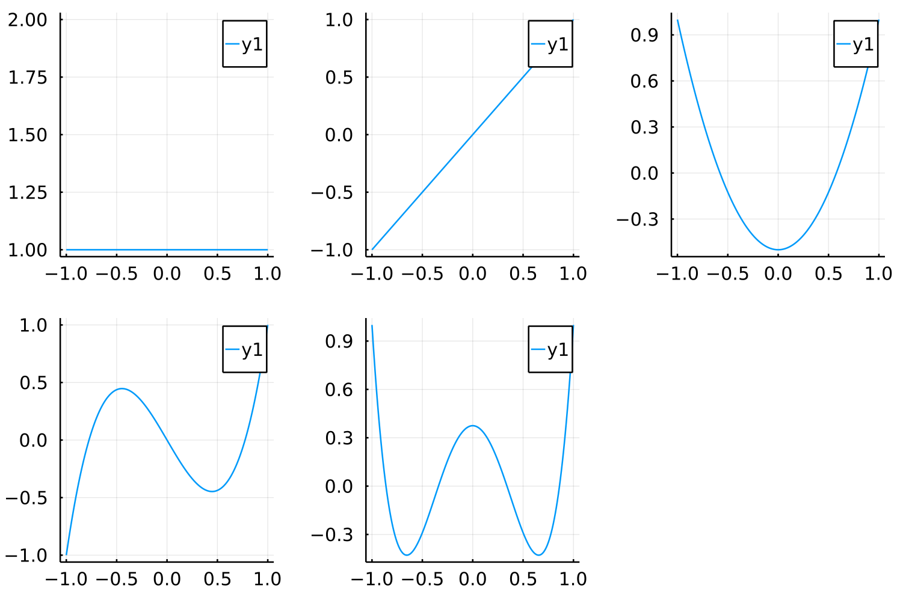

# Meeting Notes 07.04.2021

## Electrocardiogram ST-Segment Morphology Delineation Method Using Orthogonal Transformations

- time series of features: numerical summaries computed for time series
- ischaemia is a bad thing, we need to find it; it can be seen on ECGs
- orthogonal transformation:
    - reduce dimensionality
    - represents uncorrelated set of features
    - based on orthogonal basis functions
- orthogonality: similar concept to dot product; functions are independent
- Karhunen-Loeve Transform:
    - noise estimation
    - visually identifying acute ischaemic episodes
    - represent ECG morphology
    - heartbeat classification
    - <https://en.wikipedia.org/wiki/Karhunen%E2%80%93Lo%C3%A8ve_theorem>
- delineation method for ST segment morphology; change representation
- orthogonal Legendre polynomials: <https://en.wikipedia.org/wiki/Legendre_polynomials>

- LPT: <https://en.wikipedia.org/wiki/Legendre_transform>
- covariance matrix: <https://en.wikipedia.org/wiki/Covariance_matrix>
- orthogonal stuff provides information for the entire ST segments, thus being
more accurate than approaches that only use part of it
- shapes of KLT are similar to main ECG ST segment shapes: horizontal, slope,
scooping
- these don't quite correspond to actual ST shapes, so they made better ones
- they create them for a single ECG lead for LPT
- for KLT they based them on LTST DB leads
- see [7] for KLT based transform for pre-processing
- [29] and [30] for ARISTOTLE pre-processing
- 6-pole low-pass Butterworth filter cutoff at 55 Hz
- cubic spline approximation and subtraction for basewander removal
- KLT is a stochastic transform that adapts itself to the relevant data to
create better-fitting orthogonal basis functions
- find instantaneous heart rate, estimate ST segment slope
- find 9D KLT and LPT feature vector time series for each lead; based on 32
samples from the ST segment
- feature vectors are normalized
- we can find the distance between the feature vectors once they are normalized
- we use Mahalanobis distance (distance between vectors) for this
- their coefficients are available on PhysioNet

- basically, we create the appropriate matrices for KLT and LPT and then apply
these matrices to a 32 sample ST segment
- the resulting feature vector is then normalized

# Notes

- write draft and send to Imanaliev for comments until the end of this week
    - get some feedback that can help me with my further work
    - find out what his requirements are and how I should approach them
- look into ECG digitizers
- try to understand implementation of this KLT/LPT method
- look at which parameters are stored on PhysioNet
